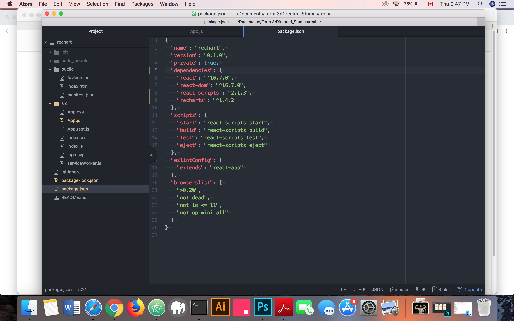
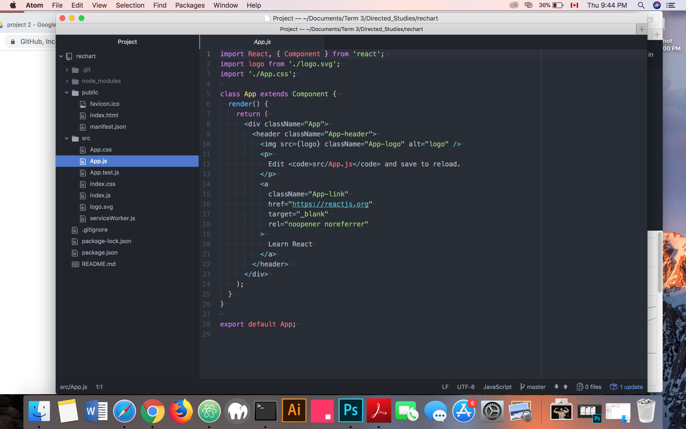
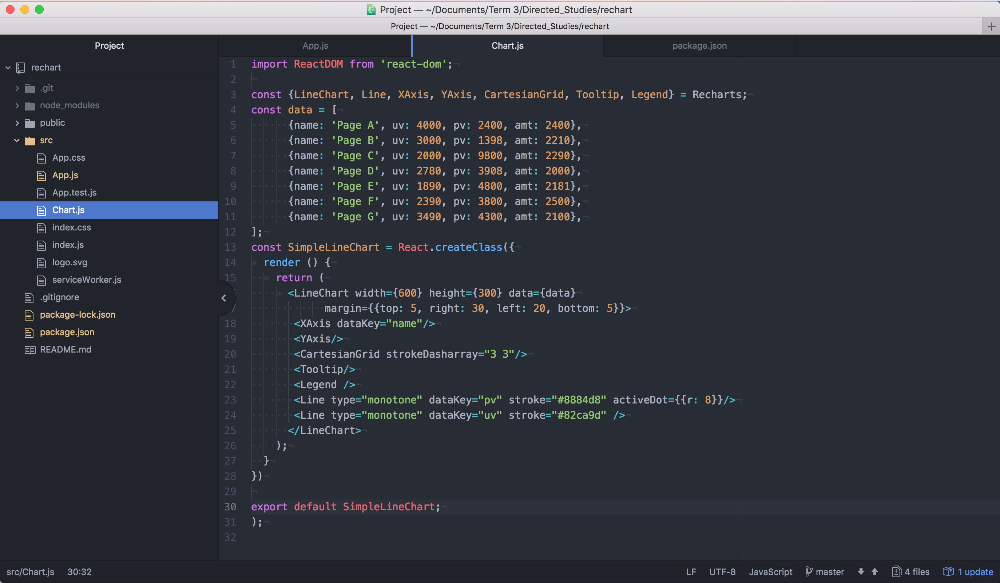
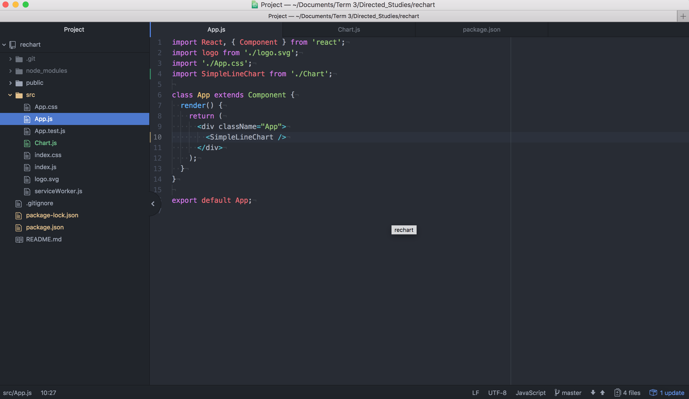

# Week 2
## Progress Report
- Reading documentation of Recharts.js
- Set up the installation
## Installation steps
- Create react app and rechart folder by terminal

- App.js: is the file to import all the components

- Create a new file called chart.js for an example of SimpleLineChart and remember to import in App.js

