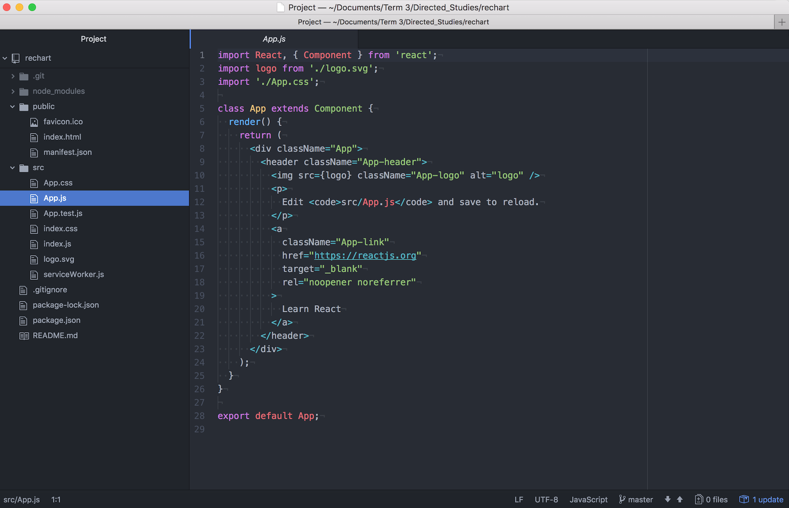

# Week 2
## Progress Report
- Reading the documentation of Recharts.js
- Set up the installation
- Trying to apply a simple line chart from example of the Recharts website
## Installation steps
- Create react app and rechart folder by terminal

- App.js: is the file to import all the components

- Create a new file called chart.js for an example of SimpleLineChart and remember to import it in App.js

## Next week plan
- Continue making the linechart
- Get familiar with how files are organized in the rechart folder

