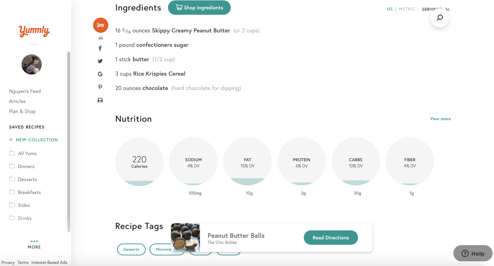
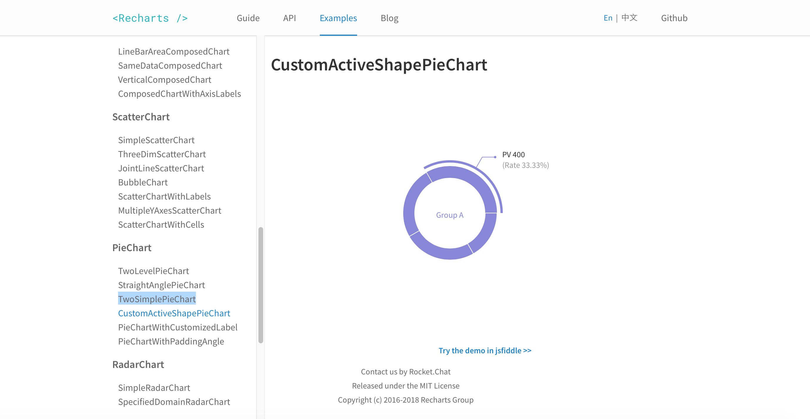

# Week 3
## Progress Report
- Study the fun attributes 
- Set up the installation
- Applied a simple line chart from the Recharts website's example

## Prototype for Tutorial
- Piechart for the nutrients to show how much mg/g in the food recipe
Reference from Yummly Website

- Visualize by pie chart and can interact with the chart

