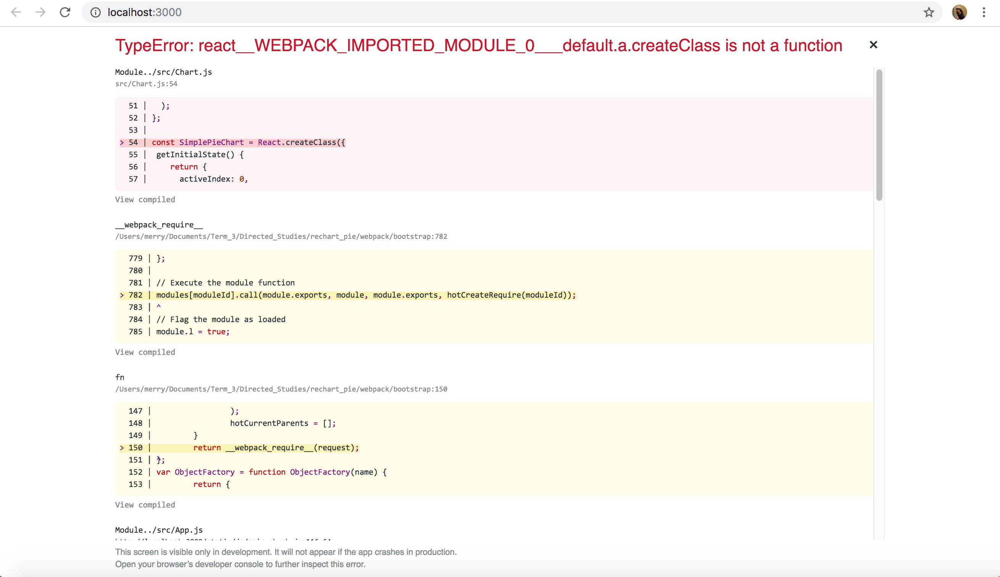

# Week 3
## Progress Report
- Studied the definition and function of each attribute such as line, XAxis, YAxis, Tooltip, Legend
- Applied a simple piechart from the Recharts website's example 
Example has errors and need to install the create.react class

## Prototype for Tutorial
- Piechart for the nutrients to show how much mg/g in the food recipe
Reference from Yummly Website

- Visualize by pie chart and can interact with the chart

