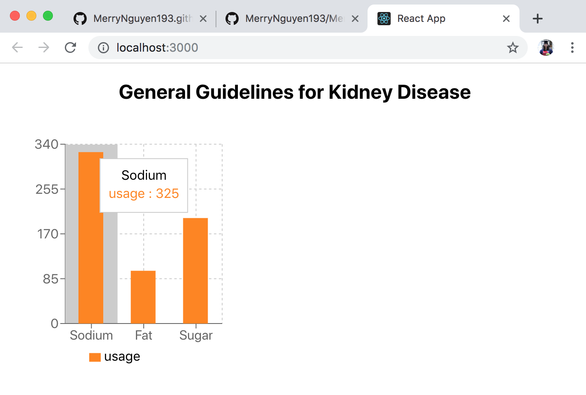

# Week 4
## Progress Report
- Editted a simple piechart from the Recharts website's example.

- Customized the new piechart to show the % of the usage of Fat nutrient 
- Changed atributes: data, COLOURS
- Added Tooltip atribute to show the label of each cell

- Customized the bar chart to show the level of 3 nutrients in a general guideline of one disease

## Next week Plan
- Tutorial for creating charts that will be used in our Project 2 's website 
