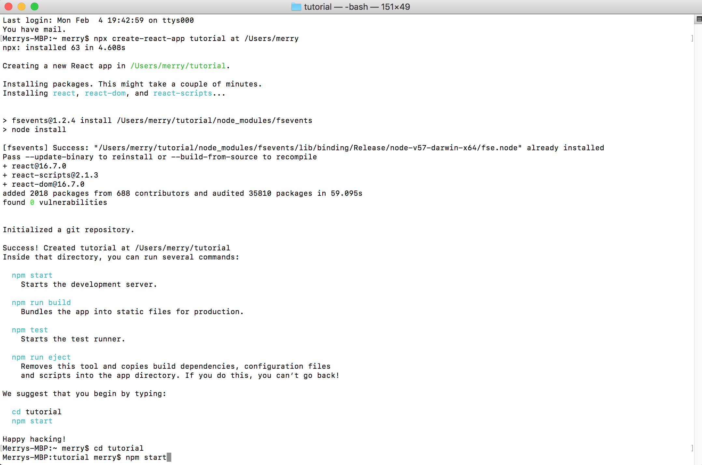
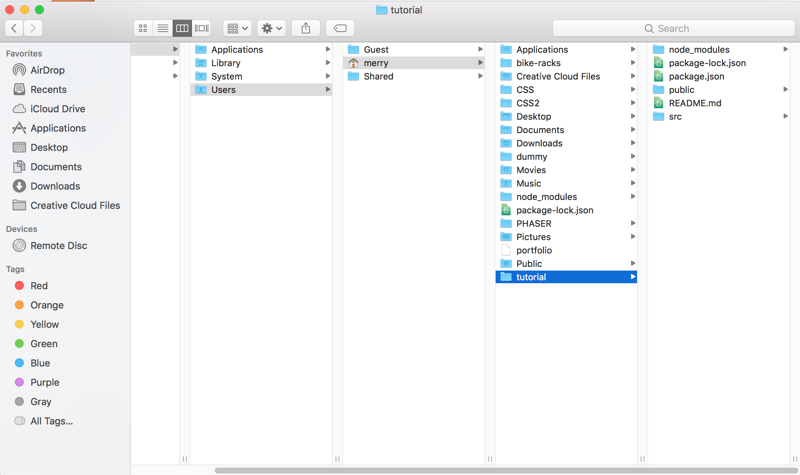

# Rechart.js Tuttorial
## Introduction
- Recharts is a charting library built on React components. 

## Prerequisite Knowledge
### React Installation 
- Create react: https://github.com/facebook/create-react-app
- Place the code in terminal : `npx create-react-app my-app` 
- "my-app" can be replaced by a name of folder; for example, "tutorial" 
- Go to "tutorial" folder: `cd tutorial`
- Run the react: `npm start`




## Required Readings
- [Install React](https://github.com/facebook/create-react-app)
- [Rechart Introduction](http://recharts.org/en-US/guide)
- [Getiing Started](http://recharts.org/en-US/guide/getting-started)
- [Customize basic components](http://recharts.org/en-US/guide/customize)

## Create customized charts
- Open src folder in Atom, duplicate App.js and rename to Chart.js


### React Installation 
- Replace code in App.js to: `import React, { Component } from 'react';`
`import logo from './logo.svg';`
`import './App.css';`
`import TwoLevelPieChart from './Chart';`

`class App extends Component {`
  `render() {`
    `return (`
      `<div className="App">`
        `<TwoLevelPieChart />`
      `</div>`
    `);`
  `}`
`}`

`export default App;`

```import React, { Component } from 'react';
import logo from './logo.svg';
import './App.css';
import TwoLevelPieChart from './Chart';

class App extends Component {
  render() {
    return (
      <div className="App">
        <TwoLevelPieChart />
      </div>
    );
  }
}

export default App;```
