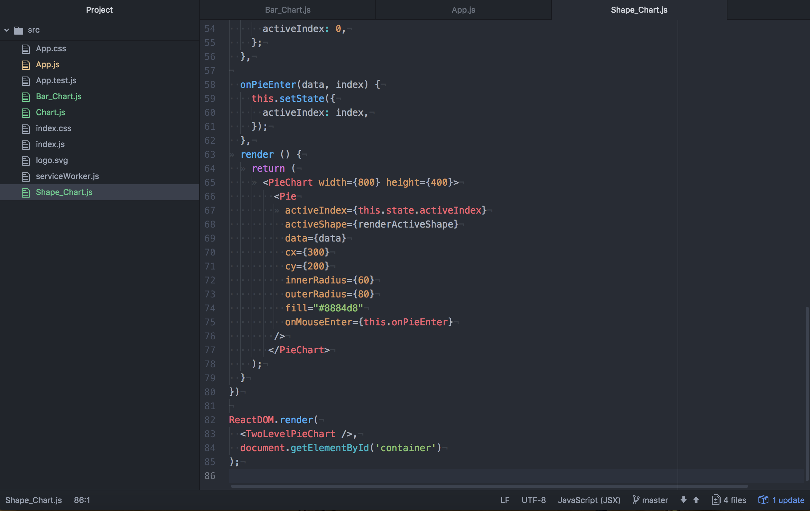

# Rechart.js Tuttorial
## Introduction
- Recharts is a charting library built on React components. 
## What will be learn
- Project 2 is for data visualization and might be built on React, studying Recharts provides different types of charts for the website
- Created two types of charts: Pie Chart and Bar Chart
- Website's mockup


## Prerequisite Knowledge
### React Installation 
- Create react: https://github.com/facebook/create-react-app
- Place the code in terminal : `npx create-react-app my-app` 
- "my-app" can be replaced by a name of folder; for example, "tutorial" 
- Go to "tutorial" folder: `cd tutorial`
- Run the react: `npm start`


## Required Readings
- [Install React](https://github.com/facebook/create-react-app)
- [Rechart Introduction](http://recharts.org/en-US/guide)
- [Getiing Started](http://recharts.org/en-US/guide/getting-started)
- [Customize basic components](http://recharts.org/en-US/guide/customize)

## Create customized charts
- Open src folder in Atom, replace code in App.js to: 

```
import React, { Component } from 'react';
import logo from './logo.svg';
import './App.css';
import SimplePieChart from './Chart';

class App extends Component {
  render() {
    return (
      <div className="App">
        <SimplePieChart />
      </div>
    );
  }
}

export default App;
```
- Create a new js file called Chart (Chart.js) and paste the first import line: `import React, { Component } from 'react';`

### Create A Simple Pie Chart
[Simple Pie Chart](http://recharts.org/en-US/examples/PieChartWithCustomizedLabel)
- Get sample code from this [link](https://jsfiddle.net/alidingling/c9pL8k61/) and place in Chart.js file, keep the first import line


- Edit code in Chart.js as below:

```
import React, { Component } from 'react';

import { PieChart, Pie, Sector, Cell, Tooltip } from 'recharts';
const data = [{name: 'Group A', value: 400}, {name: 'Group B', value: 300},
                  {name: 'Group C', value: 300}, {name: 'Group D', value: 200}];
const COLORS = ['#0088FE', '#00C49F', '#FFBB28', '#FF8042'];

const RADIAN = Math.PI / 180;
const renderCustomizedLabel = ({ cx, cy, midAngle, innerRadius, outerRadius, percent, index }) => {
 	const radius = innerRadius + (outerRadius - innerRadius) * 0.5;
  const x  = cx + radius * Math.cos(-midAngle * RADIAN);
  const y = cy  + radius * Math.sin(-midAngle * RADIAN);

  return (
    <text x={x} y={y} fill="white" textAnchor={x > cx ? 'start' : 'end'} 	dominantBaseline="central">
    	{`${(percent * 100).toFixed(0)}%`}
    </text>
  );
};

const SimplePieChart = props => {
  	return (
    	<PieChart width={800} height={400}>
        <Pie
          data={data}
          cx={300}
          cy={200}
          labelLine={false}
          label={renderCustomizedLabel}
          outerRadius={80}
          fill="#8884d8"
        >
        	{
          	data.map((entry, index) => <Cell fill={COLORS[index % COLORS.length]}/>)
          }
        </Pie>
      </PieChart>
    );
  }
export default SimplePieChart;

```


- Open Terminal and write: `npm start`, the browser will show a pie chart


### Customize A Simple Pie Chart
- Base on this pie chart, customize the new piechart to show the % of Fat nutrient in one recipe
#### Changed atributes: data, COLOURS
- Change data(name and value) to 2 group: "Usage"(200) and "Total"(800)
- Change COLOURS to '#ff8500', '#CCCCCC'


#### Added Tooltip atribute to show the label of each cell
- Paste the code `<Tooltip/>` above the `</PieChart>`, and remember to add it in the second line of import {}


### Create A Custom Active Shape Pie Chart
- Replace code in App.js to: 

```
import React, { Component } from 'react';
import logo from './logo.svg';
import './App.css';
import SimplePieChart from './Chart';
import TwoLevelPieChart from './Chart';

class App extends Component {
  render() {
    return (
      <div className="App">
        <SimplePieChart />
        <TwoLevelPieChart />
      </div>
    );
  }
}

export default App;
```
- Create a new js file called Shape_Chart (Shape_Chart.js) and paste the first import line: `import React, { Component } from 'react';`
[Custom Active Shape Pie Chart](http://recharts.org/en-US/examples/CustomActiveShapePieChart)
- Get sample code from this [link](https://jsfiddle.net/alidingling/hqnrgxpj/) and place in Shape_Chart.js file, keep the first import line



- Edit code in Shape_Chart.js as below:
```
import React, { Component } from 'react';
import {PieChart, Pie, Sector} from 'recharts';

const data = [{name: 'Fat', value: 10}, {name: 'Cacbohydrates', value: 20},
                  {name: 'Protein', value: 20}];

const renderActiveShape = (props) => {
  const RADIAN = Math.PI / 180;
  const { cx, cy, midAngle, innerRadius, outerRadius, startAngle, endAngle,
    fill, payload, percent, value } = props;
  const sin = Math.sin(-RADIAN * midAngle);
  const cos = Math.cos(-RADIAN * midAngle);
  const sx = cx + (outerRadius + 10) * cos;
  const sy = cy + (outerRadius + 10) * sin;
  const mx = cx + (outerRadius + 30) * cos;
  const my = cy + (outerRadius + 30) * sin;
  const ex = mx + (cos >= 0 ? 1 : -1) * 22;
  const ey = my;
  const textAnchor = cos >= 0 ? 'start' : 'end';

  return (
    <g>
      <text x={cx} y={cy} dy={8} textAnchor="middle" fill={fill}>{payload.name}</text>
      <Sector
        cx={cx}
        cy={cy}
        innerRadius={innerRadius}
        outerRadius={outerRadius}
        startAngle={startAngle}
        endAngle={endAngle}
        fill={fill}
      />
      <Sector
        cx={cx}
        cy={cy}
        startAngle={startAngle}
        endAngle={endAngle}
        innerRadius={outerRadius + 6}
        outerRadius={outerRadius + 10}
        fill={fill}
      />
      <path d={`M${sx},${sy}L${mx},${my}L${ex},${ey}`} stroke={fill} fill="none"/>
      <circle cx={ex} cy={ey} r={2} fill={fill} stroke="none"/>
      <text x={ex + (cos >= 0 ? 1 : -1) * 12} y={ey} textAnchor={textAnchor} fill="#333">{`${value}mg`}</text>
      <text x={ex + (cos >= 0 ? 1 : -1) * 12} y={ey} dy={18} textAnchor={textAnchor} fill="#999">
        {`${(percent * 100).toFixed(0)}%`}
      </text>
    </g>
  );
};

class TwoLevelPieChart extends Component {
  state = {
    activeIndex: 0
  }

  onPieEnter = (data, index) => {
    this.setState({
      activeIndex: index,
    });
  }
  render () {
    return (
      	<PieChart width={800} height={400}>
          <Pie
          	activeIndex={this.state.activeIndex}
            activeShape={renderActiveShape}
            data={data}
            cx={300}
            cy={200}
            innerRadius={60}
            outerRadius={80}
            fill="#ff8500"
            onMouseEnter={this.onPieEnter}
          />
         </PieChart>
      )
  }

}

export default TwoLevelPieChart;
```
- Type in terminal `npm start`


### Create A Vertical Bar Chart
- Create a new js file called Bar_Chart (Bar_Chart.js) 
- Get sample code from this [link](https://jsfiddle.net/alidingling/shjsn5su/) and place in Bar_Chart.js file

- Change the code into: 

```
import React, { Component } from 'react';

import {ComposedChart, Line, Area, Bar, XAxis, YAxis, CartesianGrid, Tooltip, Legend} from 'recharts';

const data = [{name: 'Page A', uv: 590, pv: 800, amt: 1400},
              {name: 'Page B', uv: 868, pv: 967, amt: 1506},
              {name: 'Page C', uv: 1397, pv: 1098, amt: 989},
              {name: 'Page D', uv: 1480, pv: 1200, amt: 1228},
              {name: 'Page E', uv: 1520, pv: 1108, amt: 1100},
              {name: 'Page F', uv: 1400, pv: 680, amt: 1700}];

const LineBarAreaComposedChart = props => {
  	return (
    	<ComposedChart layout="vertical" width={600} height={400} data={data}
            margin={{top: 20, right: 20, bottom: 20, left: 20}}>
          <CartesianGrid stroke='#f5f5f5'/>
          <XAxis type="number"/>
          <YAxis dataKey="name" type="category"/>
          <Tooltip/>
          <Legend/>
          <Area dataKey='amt' fill='#8884d8' stroke='#8884d8'/>
          <Bar dataKey='pv' barSize={20} fill='#413ea0'/>
          <Line dataKey='uv' stroke='#ff7300'/>
       </ComposedChart>
    );
  }

export default LineBarAreaComposedChart;

```
- Import bar_chart in App.js: `import LineBarAreaComposedChart from './Bar_Chart';` and add in a container


### Customize A Bar Chart
- Reference Bar Chart


- Base on this bar chart, customize the new pbar chart to show the level of 3 nutrients for general guideline

#### Changed atributes: data, COLOURS
- Change data(name and value) to 3 group: Fibre, Sodium and Fat
- Change fill of <Bar> to '#ff8500'
- Delete some attributes
- Completed code is shown below:

```
import React, { Component } from 'react';
import {ComposedChart, Bar, XAxis, YAxis} from 'recharts';

const data = [{name: 'Fibre', uv: 590, pv: 800, amt: 1400},
              {name: 'Sodium', uv: 868, pv: 967, amt: 1506},
              {name: 'Fat', uv: 1397, pv: 1098, amt: 989}];

const LineBarAreaComposedChart = props => {
  	return (
    	<ComposedChart layout="vertical" width={600} height={400} data={data}
            margin={{top: 20, right: 20, bottom: 20, left: 20}}>
          <XAxis hide="true" type="number"/>
          <YAxis dataKey="name" type="category"/>
          <Bar dataKey='pv' barSize={25} fill='#ff8500'/>
       </ComposedChart>
    );
  }

export default LineBarAreaComposedChart;

```


