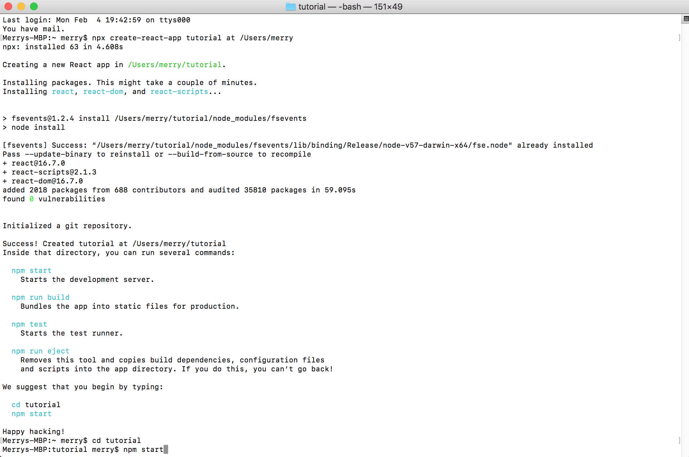
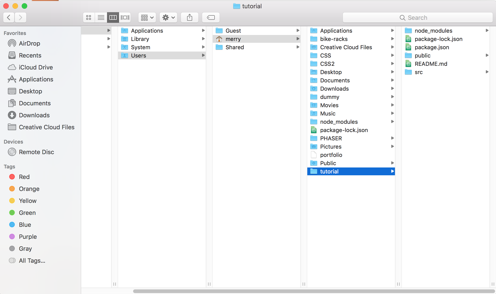
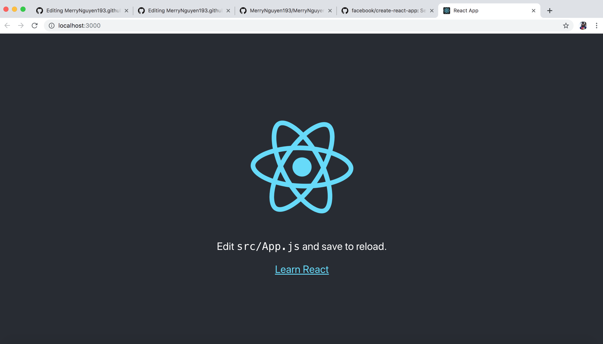
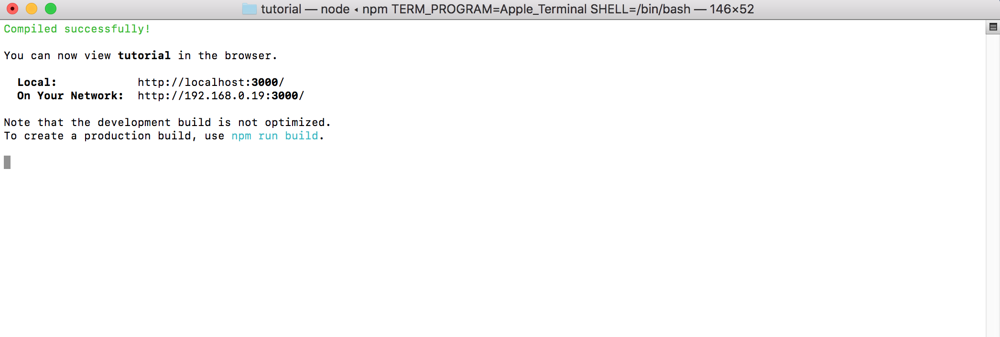

# Rechart.js Tuttorial
## Introduction
- Recharts is a charting library built on React components. 

## Prerequisite Knowledge
###### Installation React
- Create react: https://github.com/facebook/create-react-app
- Place the code in terminal : `npx create-react-app my-app` 
- "my-app" can be replaced by a name of folder; for example, "tutorial" 
- Go to "tutorial" folder: `cd tutorial`
- Run the react: `npm start`

## Required Readings
- https://github.com/facebook/create-react-app
- http://recharts.org/en-US/guide
- http://recharts.org/en-US/guide/getting-started
- http://recharts.org/en-US/guide/customize

